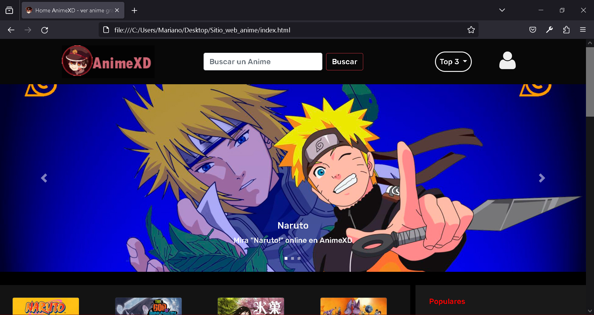
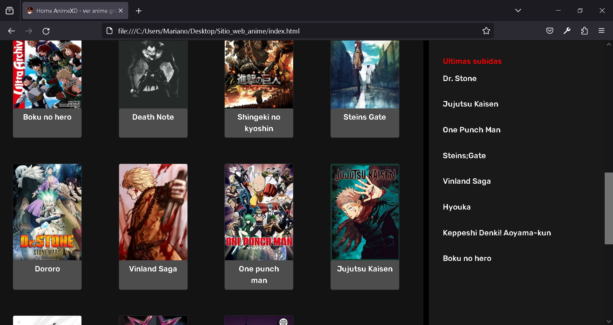
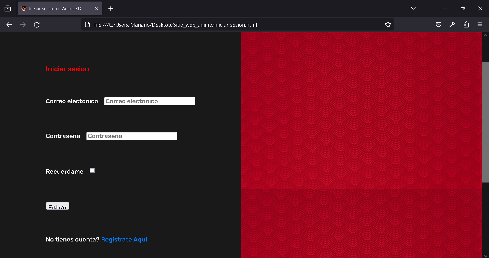
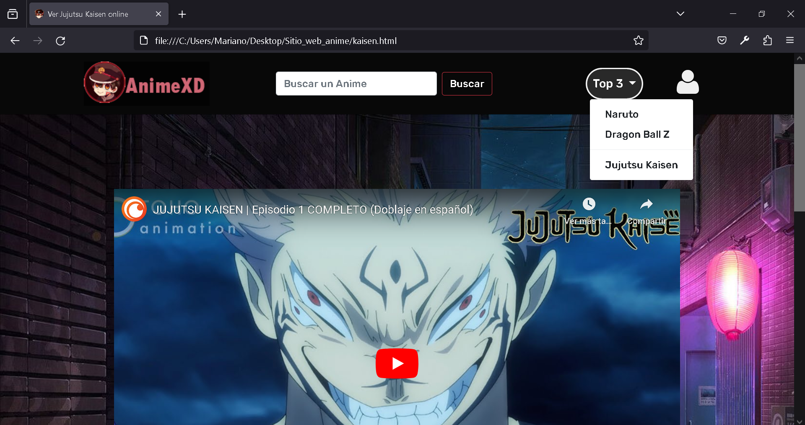

# AnimeXD
LINK (caido)- https://marianoguevara.github.io/HTML-CSS-Sitio-para-ver-anime-visual-/

Sitio web de anime. Fue creado para practicar HTML/CSS. 
Incluye html, css, scss y bootstrap.

Se puede navegar entre las paginas y ver los videos de youtube anexados. Funciona en mobile; es responsive.
Es todo visual. La barra de busqueda, el registro, etc, no son interactuables

Visual: 
## 
## 
## 
## 